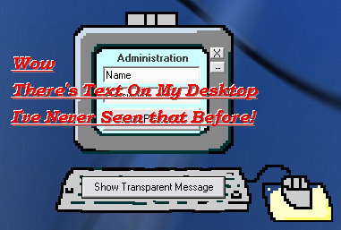



## Custom Shaped Form Example \- Transparent  Cls \- Any O\.S\.

### Description

This Transparent Class Module Will Allow you To Create Custom Shaped Forms With Ease! Very Flexible. (With transparent text example)
 
### More Info
 

             |
---                |---
**Submitted On**   |2004-05-03 07:58:04
**By**             |[Peter\.](https://github.com/Planet-Source-Code/PSCIndex/blob/master/ByAuthor/peter.md)
**Level**          |Intermediate
**User Rating**    |5.0 (15 globes from 3 users)
**Compatibility**  |VB 5\.0, VB 6\.0
**Category**       |[Custom Controls/ Forms/  Menus](https://github.com/Planet-Source-Code/PSCIndex/blob/master/ByCategory/custom-controls-forms-menus__1-4.md)
**World**          |[Visual Basic](https://github.com/Planet-Source-Code/PSCIndex/blob/master/ByWorld/visual-basic.md)
**Archive File**   |[Custom\_Sha174039532004\.zip](https://github.com/Planet-Source-Code/peter-custom-shaped-form-example-transparent-cls-any-o-s__1-53522/archive/master.zip)

